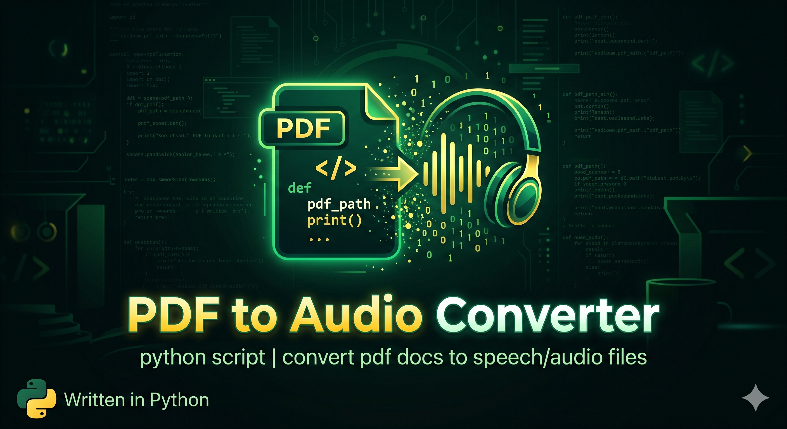

# pdf2audio



Convert PDF documents to audio using fully local, offline TTS. No cloud, no API keys.

**Pipeline:** PDF → text extraction (pymupdf) → speech synthesis (Kokoro TTS) → opus audio (ffmpeg)

**Smart text cleaning:**
- Footnotes stripped by font-size detection
- References/Bibliography section removed
- Inline citations `[1]`, `(Smith et al., 2023)` removed

## Requirements

- macOS (uses `open` to play result)
- [uv](https://docs.astral.sh/uv/) — Python package manager
- [ffmpeg](https://ffmpeg.org/) — audio encoding

## Install

**1. Install system deps**

```bash
brew install ffmpeg uv
```

**2. Clone / download this repo**

```bash
git clone <repo-url>
cd pdf2audio
```

**3. Create venv and install Python deps**

```bash
uv venv
uv sync
```

> First run downloads Kokoro model weights (~300MB) from Hugging Face automatically.

## Usage

**Interactive file browser (no argument):**

```bash
./pdf2audio.sh
```

Navigate with `↑↓`, `Enter` to open folder or select PDF, `q` to quit.  
Folders shown as `[name]` at top, PDF files below. `[..]` to go up.

**Direct path:**

```bash
./pdf2audio.sh --file=~/Downloads/paper.pdf
./pdf2audio.sh --file="~/Downloads/My Papers/paper.pdf" --open
```

**Options:**

| Option | Description |
|--------|-------------|
| `--file=PATH` | Path to input PDF (omit to use file browser) |
| `--open` | Open output audio file after conversion |
| `--help` | Show usage info |

Output `.opus` saved next to source PDF.

## Configuration

Edit the top of `pdf2audio.sh` to change voice or speed:

```bash
VOICE="af_heart"   # TTS voice
SPEED=1.0          # 1.0 = normal, 1.5 = faster
```

**Available voices** (Kokoro 82M model):

| Code | Description |
|------|-------------|
| `af_heart` | American English, female (default) |
| `am_adam` | American English, male |
| `bf_emma` | British English, female |
| `bm_george` | British English, male |

## Notes

- Processing time scales with PDF length — expect ~1 min per 10 pages on CPU (no GPU needed)
- Image-only / scanned PDFs will fail — text layer required
- Output is ~24kbps opus, highly compressed (~1MB per hour of audio)
